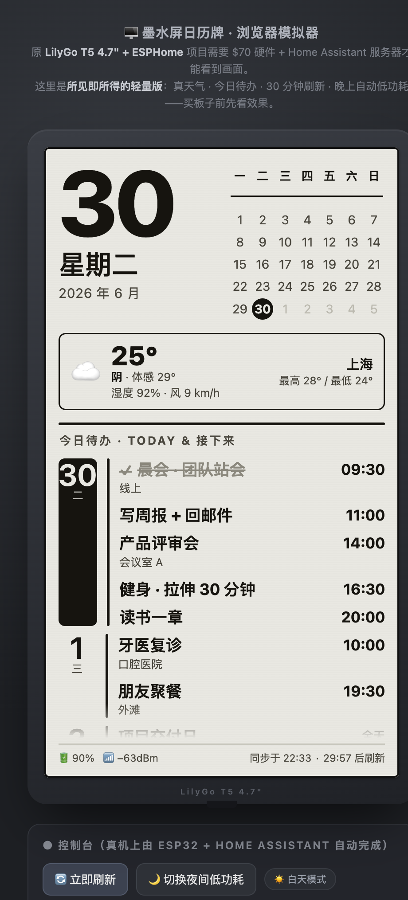

# 墨水屏日历牌 · E‑Ink Calendar (Browser Simulator)

一个**单文件、零依赖、离线可跑**的电子墨水屏日历牌**浏览器模拟器**。

👉 **在线体验 / Live demo:** https://hannahlovegood.github.io/eink-calendar/

## 这是什么 / What

原版 [AppForce1/lilygo-t5-47-plus-esphome](https://github.com/AppForce1/lilygo-t5-47-plus-esphome) 是一块真实硬件:
**LilyGo T5 4.7" ePaper + ESP32‑S3**,通过 **ESPHome + Home Assistant** 把日历事件画到墨水屏上。
它很棒,但要看到画面你得先有 ~$70 的板子 + 一台常开的 Home Assistant 服务器。

这个项目把它的**核心体验抽出来搬进浏览器**,买板子前先所见即所得 —— 并补上了原项目**没有**的天气:

- 🗓️ 大日期 + 迷你月历(今日描黑圈),忠实复刻原版版面
- 🌤️ **实时天气**(来自 [Open‑Meteo](https://open-meteo.com),**免 API Key**)
- ✅ **今日待办**,可编辑,存在浏览器 `localStorage`(数据不出本机)
- ⏱️ **每 30 分钟刷新**倒计时 + 电子墨水"黑闪"刷新动画
- 🌙 **晚上自动低功耗**(22:00–06:00 深睡,屏幕保留最后画面)

## 怎么用 / Usage

直接打开 `index.html` 即可,无需任何环境、构建或服务器。

- 改城市 → 取当地天气(离线时自动用示例数据)
- 编辑/勾选/删除待办 → 自动保存到本地
- ☀️/🌙 手动切换白天 / 夜间低功耗

## 这不是什么 / Not

- 不是真机固件。要在真实 LilyGo T5 上跑,请用[原项目](https://github.com/AppForce1/lilygo-t5-47-plus-esphome)。
- 没有后端、没有账号、没有追踪。一个 HTML 文件而已。

## 致谢 / Credits

- 硬件实现:[AppForce1/lilygo-t5-47-plus-esphome](https://github.com/AppForce1/lilygo-t5-47-plus-esphome)
- 最初灵感:[paviro/ESPHome-ePaper-Calendar](https://github.com/paviro/ESPHome-ePaper-Calendar)
- 天气数据:[Open‑Meteo](https://open-meteo.com)(免费、无需 Key)

## License

MIT — 随便用。本模拟器为独立重写,不包含原项目任何固件代码。
